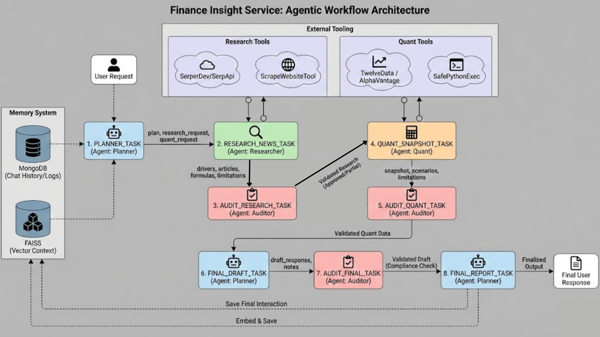

# Finance Insight Service

## Overview
Finance Insight Service is an AI-powered assistant for financial research and analysis. It combines current market context with deterministic calculations to deliver concise, evidence-aware responses.

## Key Features
- **Evidence-aware research** - Collects relevant financial context before answering
- **Deterministic quant** - All numbers are computed, not guessed
- **Audited responses** - Final output is validated with clear limitations


## Architecture

The system runs a sequential workflow with explicit quality gates:

1. **Research** - Collects relevant financial context and evidence
2. **Quant** - Computes required metrics and scenarios deterministically
3. **Audit** - Validates outputs and produces the final response

Design principles:
- Strict handoff between stages to preserve context and quality
- Deterministic computations instead of LLM-generated numbers
- Transparent limitations whenever data is missing or uncertain



## FAISS Context Store
The project uses FAISS (Facebook AI Similarity Search) for fast semantic retrieval of financial context. The index is stored at `data/faiss.index` and is created/updated automatically on first use.

## AMP / Choreo Deployment

AMP repo: https://github.com/wso2/ai-agent-management-platform/tree/amp/v0

### Prerequisites
- Kubernetes cluster (k3d or equivalent)
- AMP installed (see AMP quick start guide)
- Docker registry accessible to the cluster
- API keys for OpenAI, SerpAPI, Twelve Data, Alpha Vantage

### Create Component Definition
Create `.choreo/component.yaml` in your project root:

```yaml
schemaVersion: "1.0"
id: finance-insight
name: Finance Insight Service
type: service
description: AI-powered financial research assistant
runtime: python
buildType: dockerfile
image: Dockerfile
ports:
  - port: 8000
    type: http
env:
  - name: OPENAI_API_KEY
    valueFrom: SECRET
  - name: SERPAPI_API_KEY
    valueFrom: SECRET
  - name: TWELVE_DATA_API_KEY
    valueFrom: SECRET
  - name: ALPHAVANTAGE_API_KEY
    valueFrom: SECRET
```

### Build and Push Image
```bash
docker build -t finance-insight-service:latest .
docker tag finance-insight-service:latest \
  localhost:10082/default-finance-insight-image:v1
docker push localhost:10082/default-finance-insight-image:v1
```

### Deploy via AMP Console
1. Open AMP Console at `http://default.localhost:9080`
2. Create Agent → Service → Python → Port 8000
3. Add environment variables listed above
4. Deploy and verify health at `/finance-insight/health`

## Configuration
Copy `.env.example` to `.env` and set these keys:
- `OPENAI_API_KEY`
- `SERPAPI_API_KEY`
- `TWELVE_DATA_API_KEY`
- `ALPHAVANTAGE_API_KEY`

See key setup details in [API_KEYS.md](API_KEYS.md).

## Contributing
Open an issue or submit a pull request with clear context and test notes.
